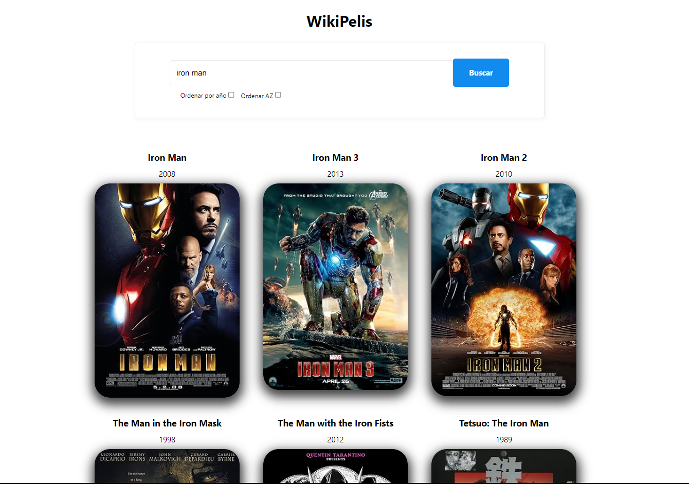

# WikiPelis

[Live Project Netlify](https://wikipelis-devrodrigolec.netlify.app/)

WikiPelis es una aplicación web que permite buscar y visualizar información sobre películas. Este proyecto fue desarrollado como parte de mi portafolio personal para demostrar mis habilidades como desarrollador frontend.

## Descripción

WikiPelis es una aplicación sencilla que utiliza la API de OMDb para buscar películas por título. Los usuarios pueden ingresar el nombre de una película en el campo de búsqueda y obtener información detallada sobre las películas coincidentes.

## Funcionalidades

- Buscar películas por título.
- Mostrar información detallada de las películas encontradas, incluyendo título, año de lanzamiento y póster.
- Ordenar películas alfabéticamente por título.
- Ordenar películas por año de lanzamiento.

## Capturas de Pantalla

## Tecnologías

- React.js: Framework para construir la interfaz de usuario.
- JavaScript: Lenguaje principal utilizado en el desarrollo.
- HTML/CSS: Utilizados para la estructura y diseño de la aplicación.
- OMDb API: API externa utilizada para obtener información sobre películas.

## Instalación

Para instalar y ejecutar la aplicación en tu entorno local, sigue estos pasos:

1. Clona este repositorio en tu máquina local.
2. Abre una terminal y navega hasta la carpeta del proyecto.
3. Ejecuta `npm install` para instalar las dependencias.
4. Ejecuta `npm run dev` para iniciar la aplicación.

## Uso

Una vez que la aplicación esté en funcionamiento, podrás realizar búsquedas de películas ingresando el nombre en el campo de búsqueda y haciendo clic en el botón "Buscar". Puedes ordenar las películas alfabéticamente o por año utilizando las casillas de verificación disponibles.

